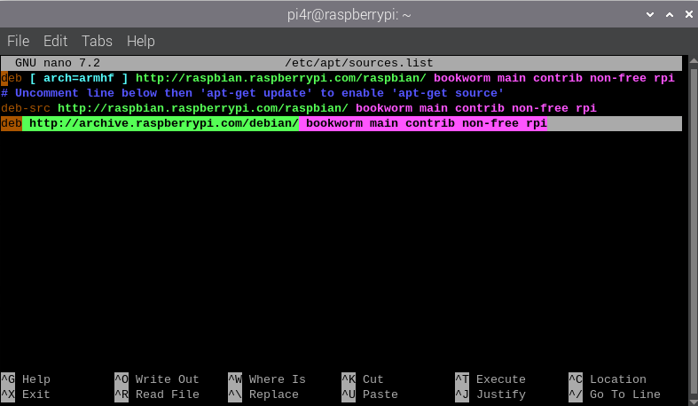

# Website Scraper / Tracker
## About the program
This is a tracker program which uses a script to extract useful data from a website. 
This implementation is more forcused on tracking and scraping the rates of cryptocurrencies. 

This README.md document will dive into **how to set up and use the program**. 

This project was **created and made for** the Linux-based operating system **Debian**. 
You will need to adjust the commands in accordance to your own operating system. 

## Getting started
**Packages to download**
- Packages for the database
  - This webpage provides clear step-by-step instructions on how to download the necessary packages for the database:  
    [Download Apache, MySQL, PHP, phpMyAdmin packages](https://randomnerdtutorials.com/raspberry-pi-apache-mysql-php-lamp-server/)
- Packages to plot the graphs
  - Open the terminal.  
    
  - Keep in mind gnuplot, the package we'll be using to plot the graphs, has been made unavailable to install normally.  
    Therefore, you will need to first add the archive which has the package to your sources.list file.
    ```
    sudo nano /etc/apt/sources.list
    ```
    
  - Add the following archive
    ```
    deb http://archive.raspberrypi.com/debian/ bookworm main contrib non-free rpi
    ```
    
  - Save the sources.list file.  
    Press [Ctrl O], then press [Enter].
  - Exit the sources.list file.
    Press [Ctrl X].
  - Install the package
    ```
    sudo apt-get install gnuplot
    ```
      
    Press [Y], then press [Enter].

**Files to download**
- getCryptoPrice.sh
- getGraph.sh

**Optional downloads**
- SQL Dump:
  - crypto_prices_db_clean.sql (no price data) **OR**
  - crypto_prices_db.sql

1. The getCryptoPrice.sh is a script to track and scrape the rates of different cryptocurrencies.  
2. The getGraph.sh is a script to plot the results stored in the database in a graph.  
3. The SQL Dumps are used to create the database used to store the results.  
   If you wish to use the SQL Dump, you will need to first create a database in phpMyAdmin.  
     
   Keep in mind you can create your own implementation of the database, however, if you made any changes to the tables or columns, you will have to alter the getCryptoPrice.sh script to accommodate for said changes. 

**Where to save the files**  
I would suggest downloading the files above to a folder named "tracker". 
If you choose to use a folder with a different name, you will need to make changes to the file paths stated in the "Running the program" section accordingly. 

1. Create a folder named "tracker" in the home directory with your username.  
   
2. Save the files you have downloaded to this folder.

## Running the program
**Setting up the data scraper to run at specified intervals**  
1. Open the terminal.  
   
2. Open crontab.
   ```
   crontab -e
   ```
   
3. Enter the following command in crontab to run the getCryptoPrice.sh script.
   ```
   */10 * * * * /home/pi4r/tracker/getCryptoPrice.sh >> /home/pi4r/tracker/errorLog.txt 2>&1
   ```
   
   Make sure to change the username of the path.
   In this case, the username is "pi4r".
   Adjust the command to run the script at your preferred intervals.  
   You can learn more about using crontab here:  
   [More about crontab](https://phoenixnap.com/kb/set-up-cron-job-linux)
4. Save the crontab.  
   Press [Ctrl O], then press [Enter].
5. Close the crontab.  
   Press [Ctrl X].

**Running the data scraper manually**
1. Open the terminal.  
   
2. Change directory to where the scripts are located.
   ```
   cd tracker
   ```
   
3. Run the getGraph.sh script.
   ```
   ./getCryptoPrice.sh
   ```
   
4. New data entries should be in the database

**Creating / Updating the graph png files**  
1. Open the terminal.  
   
2. Change directory to where the scripts are located.
   ```
   cd tracker
   ```
   
3. Open the getGraph.sh script.  
   ```
   nano getGraph.sh
   ```
   
4. Change the username of the path in the errorLogDir variable.
   In this case, the username is "pi4r".
   
6. Run the getGraph.sh script.
   ```
   ./getGraph.sh
   ```
   
7. The graph png files should be in the same directory as the scripts.

**Checking for error occurrences**
1. Open the terminal.  
   
2. Change directory to where the scripts are located.
   ```
   cd tracker
   ```
   
3. Open the errorLog.txt file.
   ```
   nano errorLog.txt
   ```
   
4. Close the errorLog.txt file.
   Press [Ctrl X].
